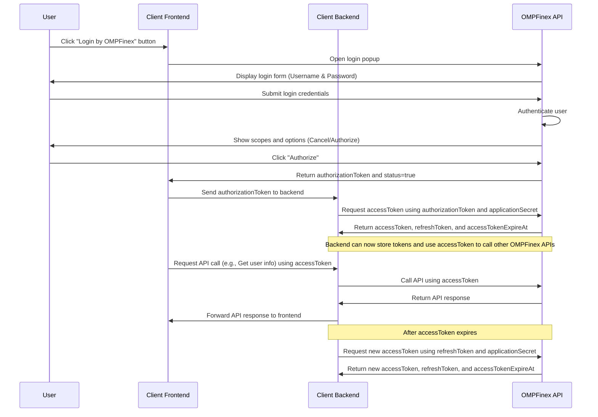

# OMPFinex OAuth Authentication Library
A simple JavaScript/TypeScript library for handling OAuth2 authentication with OMPFinex. This library provides a method to authenticate users via a popup window and supports both ES5 and TypeScript environments.

## Overview of OAuth Flow
1. **User Initiates Login**: The user clicks on the "Login by OMPFinex" button in your application, which triggers the OAuth login process.
2. **User Authentication**: A popup window is displayed where the user enters their OMPFinex credentials (username and password).
3. **User Authorization**: After successful login, the user is presented with a page to authorize your application to access specific scopes. The user can either cancel or authorize.
4. **Authorization Token Received**: Upon authorization, an `authorizationToken` and a status are sent back to your frontend via a JavaScript callback.
5. **Token Exchange**: The frontend sends the `authorizationToken` to the backend. The backend then exchanges this token for an `accessToken` and `refreshToken` by making a secure API call to OMPFinex.
6. **API Access**: The `accessToken` is used to make API calls on behalf of the user. When the `accessToken` expires, the backend can use the `refreshToken` to obtain a new `accessToken` and `refreshToken`.

### Sequence Diagram



## Installation
Install the package using npm:

```bash
npm install ompfinex-oauth
```

## Usage
### JavaScript (ES5)

This library is compatible with ES5 environments. Here’s how you can use it:

```javascript
var OMPFinex = require('ompfinex-oauth').OMPFinex;

OMPFinex.authenticate('your-application-id')
    .then(function(response) {
        if (response.status === 'OK') {
            console.log('Token:', response.data.token);
        }
    })
    .catch(function(error) {
        if (error.status === 'FAILED') {
            console.error('Authentication failed:', error.error);
        }
    });
```

### TypeScript
For TypeScript users, this library includes type definitions that make it easy to use with full type support.

```typescript
import { OMPFinex } from 'ompfinex-oauth';

OMPFinex.authenticate('your-application-id')
  .then(response => {
    if (response.status === 'OK') {
      console.log('Token:', response.data.token);
    }
  })
  .catch(error => {
    if (error.status === 'FAILED') {
      console.error('Authentication failed:', error.error);
    }
  });
```

### Parameters
- `applicationId`: **string** - The application ID provided by OMPFinex. This is required to initiate the OAuth2 authentication process.

### Response
The `authenticate` function returns a promise that resolves or rejects with the following objects:

#### Success Response
If the authentication is successful, the promise resolves with the following object:

```typescript
{
  status: 'OK';
  data: {
    token: string;  // The OAuth2 token received from OMPFinex
  };
}
```

#### Error Response
If the authentication fails, the promise rejects with the following object:

```typescript
{
  status: 'FAILED';
  error: string;  // Error message detailing why the authentication failed
}
```

## Example
Here is a complete example of how to use the library in a web application:

```typescript
import { OMPFinex } from 'ompfinex-oauth';

function login() {
  OMPFinex.authenticate('your-application-id')
    .then(response => {
      if (response.status === 'OK') {
        console.log('Token received:', response.data.token);
        // Save token and proceed with authenticated actions
      }
    })
    .catch(error => {
      console.error('Authentication error:', error.error);
      // Handle authentication failure (e.g., show an error message)
    });
}

// Example of binding the login function to a button click event
document.getElementById('loginButton').addEventListener('click', login);
```
